# 10 September RAW Medium-Dynamic Motion Metrics — 20 Seconds

Three RAW medium-dynamic flights are evaluated over the supplied 20-second windows.
Each start is the supplied cutoff + 5 s; each end is 20 s later.
Bags map to flight numbers in sorted chronological filename order.

Flights processed: 3  
[Full metrics CSV](20s/RAW/metrics.csv)  
[Selected metrics CSV](20s/RAW/selected_metrics.csv)

## Peak horizontal velocity

## RMS horizontal velocity

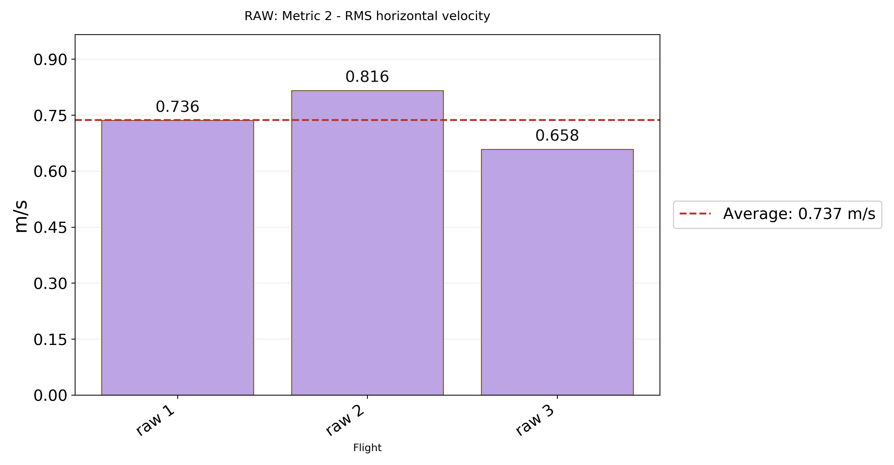

## Peak absolute X velocity

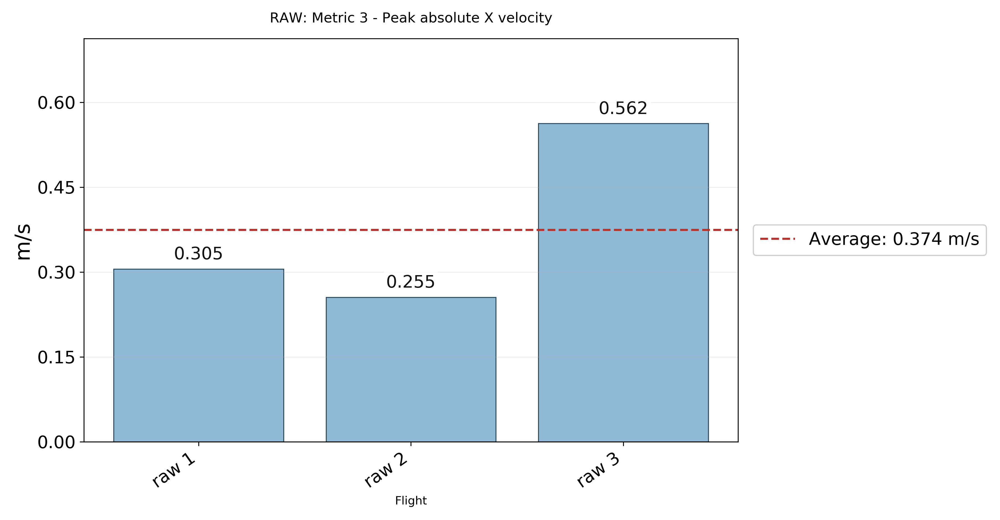

## Peak absolute Y velocity

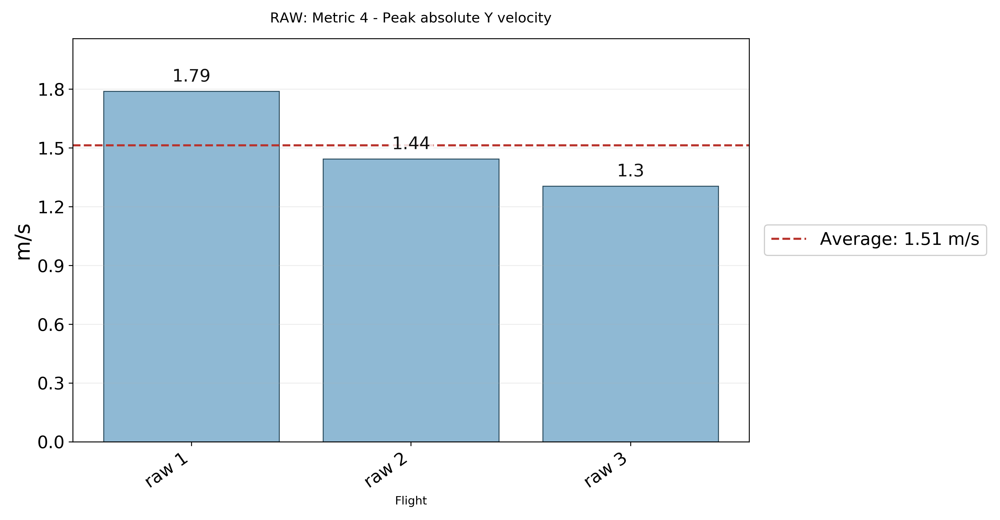

## Peak acceleration magnitude

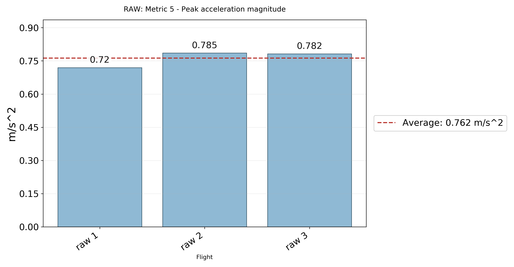

## RMS acceleration magnitude

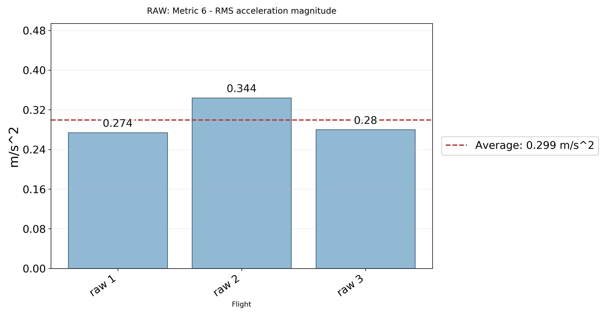

## Peak angular rate magnitude

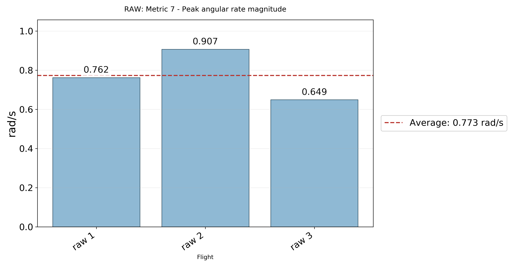

## RMS angular rate magnitude

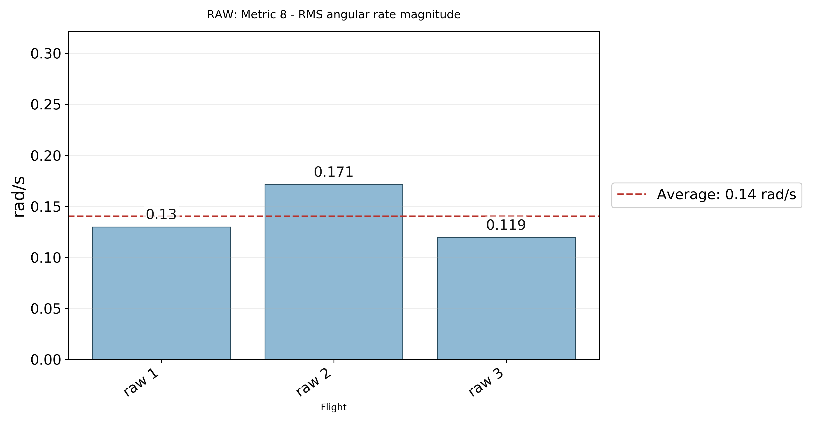

## Minimum roll angle

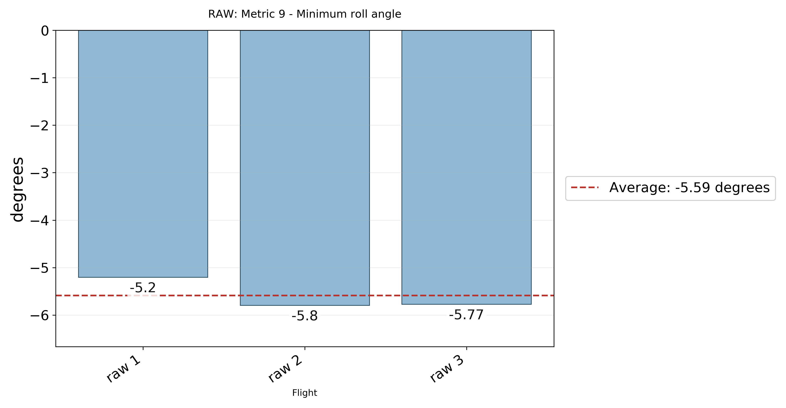

## Maximum roll angle

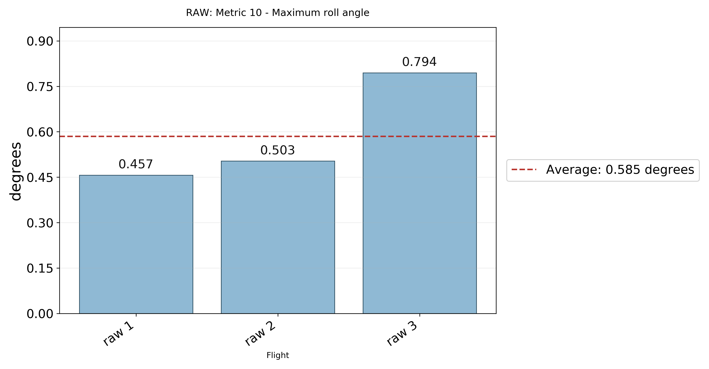

## Peak absolute roll angle

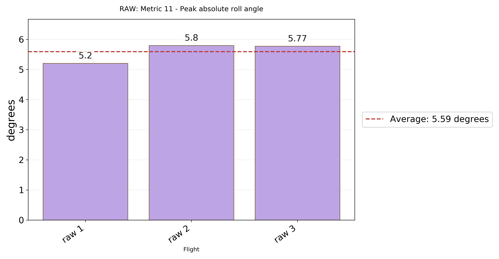

## Minimum pitch angle

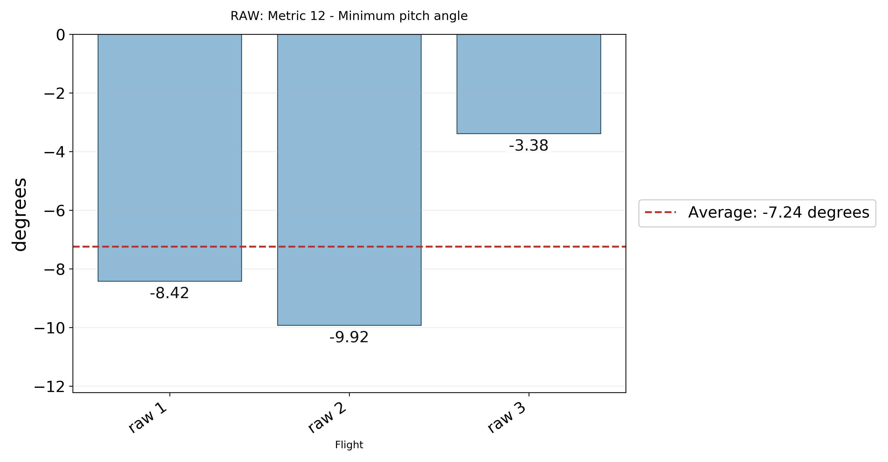

## Maximum pitch angle

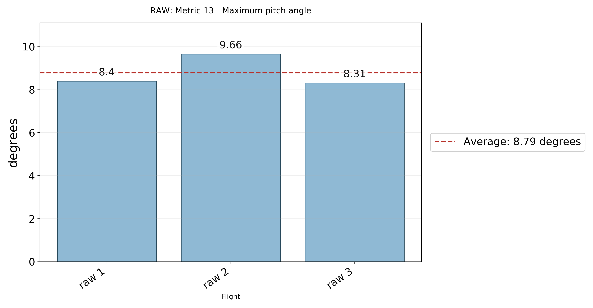

## Peak absolute pitch angle

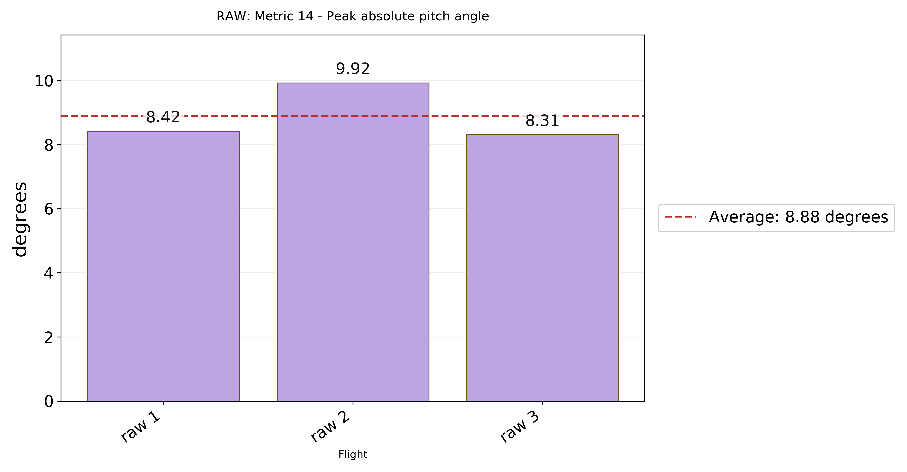

## Peak absolute yaw angle

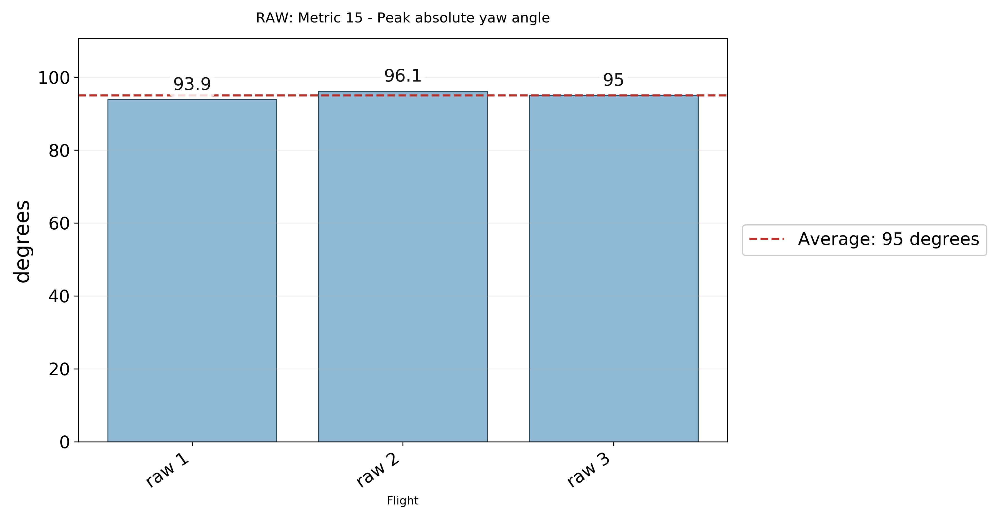

## Yaw range

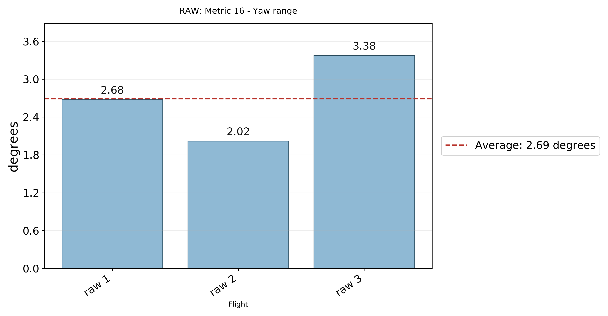
